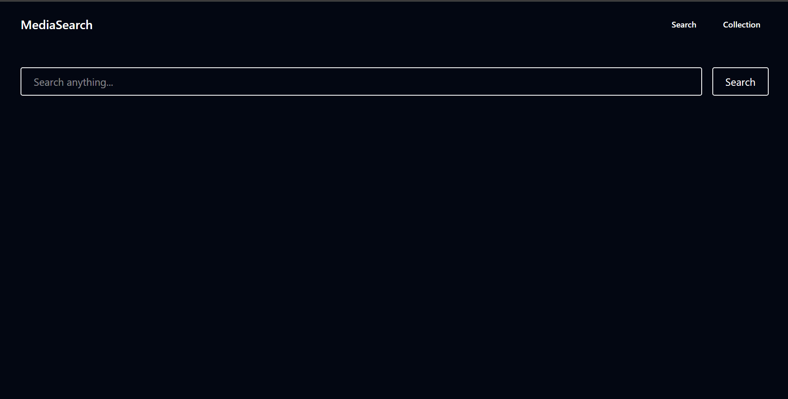
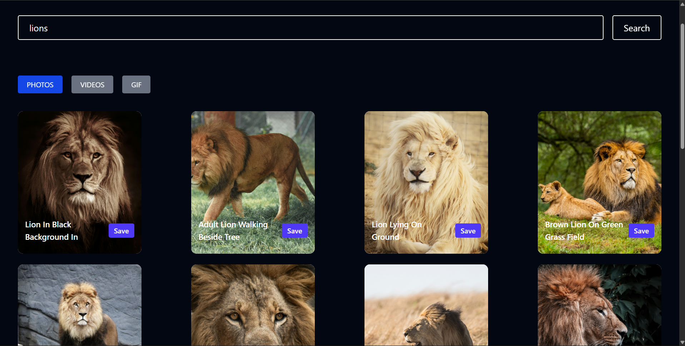
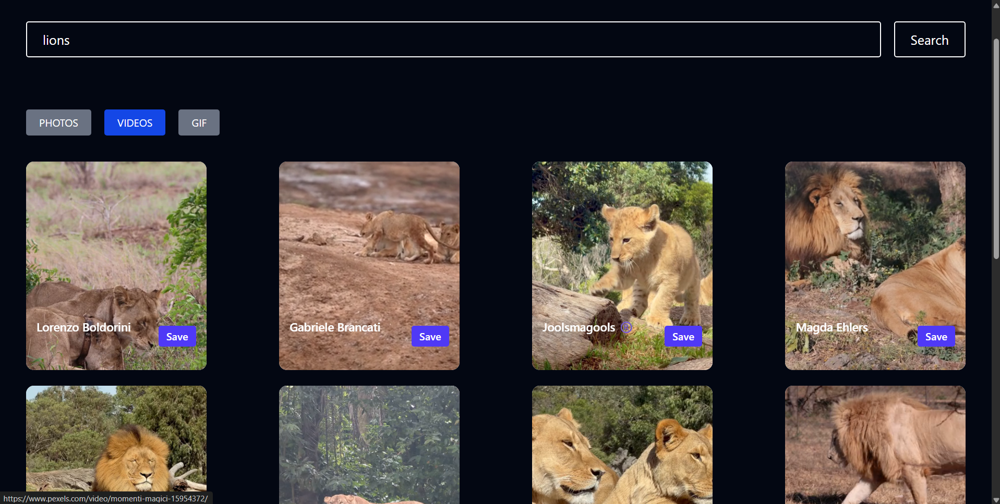
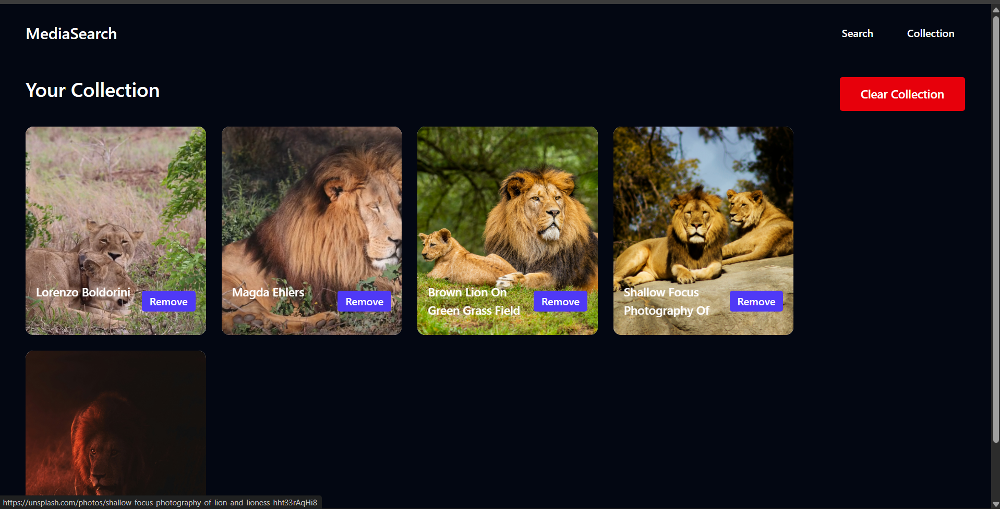

📸 MediaVault

A modern React + Redux Toolkit application that allows users to search, explore, and save their favorite photos and videos locally. The application provides a clean, responsive, and user-friendly interface with efficient state management using Redux Toolkit.

---

🚀 Features

- 🔍 Search photos and videos
- 🎥 Explore high-quality media content
- ❤️ Save favorite photos and videos locally
- ⚡ Fast and responsive user interface
- 📱 Fully responsive design
- 🔄 Centralized state management with Redux Toolkit
- 🎨 Clean and modern UI

---

🛠️ Tech Stack

- React.js
- Redux Toolkit
- JavaScript (ES6+)
- HTML5
- CSS3 / Tailwind CSS
- API Integration
- Vite

---

📂 Project Structure

src/
│── components/
│── pages/
│── redux/
│── api
│── assets/
│── App.jsx
│── main.jsx

---

⚙️ Installation

Clone the repository

git clone https://github.com/aryanKoshti/media-vault.git

Navigate to the project folder

cd media-vault

Install dependencies

npm install

Start the development server

npm run dev

---

📸 Screenshots

Add screenshots of your application here.

Example:

screenshots/

 

---

📌 Future Improvements

- User Authentication
- Cloud Storage for Saved Media
- Infinite Scrolling
- Download Feature
- Dark Mode
- Search History
- Pagination
- Category Filters

---

🤝 Contributing

Contributions are welcome.

1. Fork the repository
2. Create a new branch
3. Commit your changes
4. Push your branch
5. Open a Pull Request

---

📄 License

This project is licensed under the MIT License.

---

👨‍💻 Author - Aryan Koshti

GitHub : https://github.com/aryanKoshti

LinkedIn : https://linkedin.com/in/aryan-koshti-2bb55733b/

---

⭐ If you found this project useful, don't forget to star the repository!